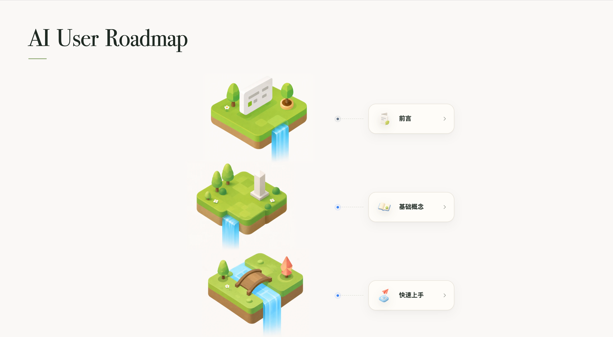

  

<h1 align="center">AI User Roadmap</h1>

一份面向普通用户、从入门到进阶的免费 AI 学习路线图。

  <a href="https://ai.heheer.com/"><strong>在线访问 AI User Roadmap →</strong></a>

  
  
  

  

## 💡 关于这个项目

这个项目整理了一条从「不知道从哪里开始」到「能把 AI 用进真实任务」的 AI 学习路线图。

它不追求覆盖所有前沿名词，也不把目标放在底层研究或 AI 应用开发上，而是希望帮普通使用者减少噪音、降低试错成本，找到一批真正值得上手的工具、文章、课程和实践方法。

## 🎯 适合谁

- 想开始系统学习 AI，但不知道先看什么的人。
- 已经会问 ChatGPT / 豆包 / DeepSeek，但想把 AI 用得更稳定的人。
- 想把 AI 放进学习、调研、写作、内容理解、编程或日常工作流的人。
- 正在筛选 AI 资料，希望少踩一点营销课、软文和过时教程坑的人。

如果你要做的是模型训练、算法研究、AI Infra 或复杂应用开发，这份 Roadmap 可能只能作为入门视角的补充。

## 🗺️ 当前内容

路线图目前分为五个阶段：

1. **前言**：为什么整理这份 Roadmap，以及它适合谁。
2. **基础概念**：理解大语言模型、Transformer、幻觉等基础概念。
3. **快速上手**：先完成第一次真正有用的 AI 使用。
4. **核心场景**：信息调研、内容理解、知识整理、写作表达、多媒体创作、编程。
5. **Agent**：理解 Agent、配置 Agent，并学习如何与 Agent 协作。

## 🤝 内容贡献

欢迎推荐更好的 AI 学习资料，也欢迎指出已经过时、质量不高或不适合新手的内容。

你可以通过 Issue / Pull Request 参与，也可以邮件联系：[heheer@zju.edu.cn](mailto:heheer@zju.edu.cn)

## 📄 许可

项目贡献者编写的原创内容与页面代码依照 [MIT License](./LICENSE) 协议授权。

项目中引用的文章、课程、开源资料、视频及其他外部链接资源，版权与许可归原作者或平台所有。本项目只做整理、推荐和跳转，不重新分发这些外部资源。
